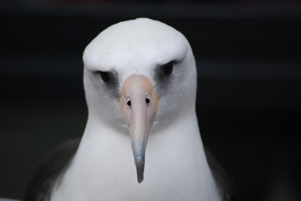

# MlOps Project

Birds Classification model 
### What is done:  
1) До 13.05 сделана основная часть  
2) 20.05 сделано усложнение 1  
### What is a problem?  
This model can classify birds into 50 classes  
For example:  
 - 0 class  
 - 1 class  
### How to use  
1) Start service with command  
```
pip3 install -r requirements.txt
python3 -m uvicorn app.main:app --reload --port=5000
```
2) Try POST  
```
curl -X POST "http://localhost:5000/forward" -F "image=@image_examples/0002.jpg"
```